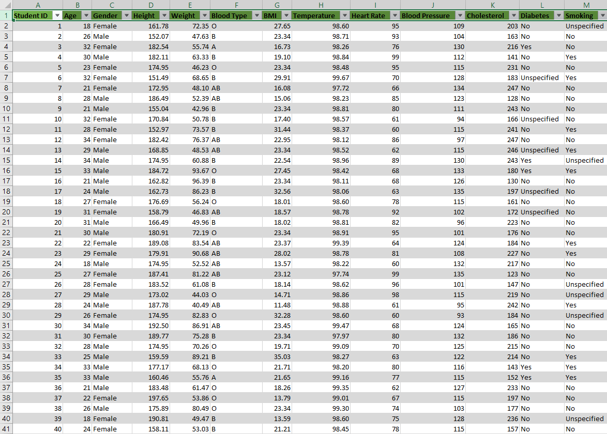
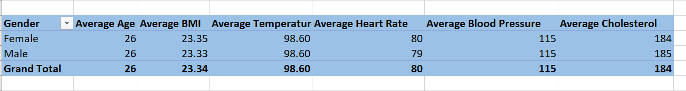
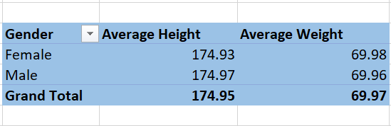
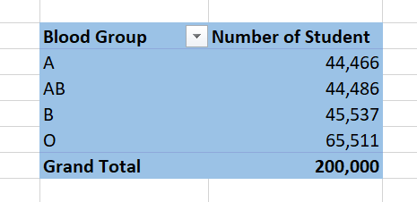
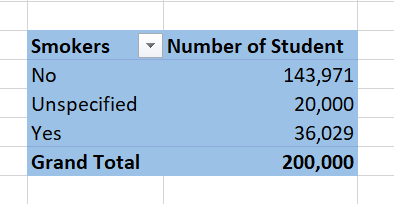
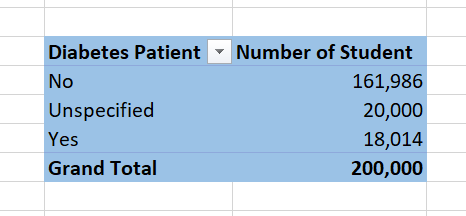

# Medical-Student
Analysis and Visualization of Health Data for Medical Students: A Comprehensive Report

## Introduction

In this in-depth examination of medical student data, I look into significant demographic and health aspects revealing important insights by building pivot tables, including average age, BMI, temperature, heart rate, blood pressure, and cholesterol for men and women, accurate height and weight statistics, a breakdown of blood groups, and a clear image of the smoking and diabetes status of pupils. 

Join me as I analyze these potential medical professionals' health profiles...🙂😉

_**Disclaimer**_ ⚠️- _All data used for this analysis are hypothetical data generated and do not represent any company's data or an attempt to endanger their performance._

## Medical-Students of "ADX TEACHING HOSPITAL"
The task is to create Pivot Tables displaying the following:
1. Average values for the following for Male and Females (Age, BMI, Temperature, Heart Rate, Blood Pressure, and Cholesterol)
2. Average Height and Weight for both Genders (in 2 decimal places)
3. Number of students across the different Blood Groups
4. Number of Students who smoke and those who don't
5. Number of Students who have diabetes and those who don't.
6. Visualize the insights gotten from the Pivot Table

## Problem Statement:

The primary goal of the analysis is to examine and draw important conclusions from a dataset of medical students' demographic data, health metrics, and lifestyle choices. Understanding the variations between the male and female students, blood types, smoking patterns, and diabetes status.

## Skill and Concept Demonstrated:

The analysis had demonstrated a range of essential data analysis skills, such as:
- Data extraction
- Data Cleaning and Transformation
- Statistical measures and conditional logic to make data-driven decisions.
- Excel functions (e.g., AVERAGEIF)
- Pivot Table Creation and Analysis
- Data Visualization

## Data Sourcing:

The medical student data was provided by the instructor in CSV format. The dataset contained information about medical students, including age, gender, BMI, temperature, heart rate, blood pressure, cholesterol, height, weight, blood group, smoking status, and diabetes status.

## Data Transformation:

After importing the CSV data into Microsoft Excel, the dataset was cleaned to resolve missing values, removing more than 40,000 blanks. To ensure data accuracy, data validation and verification were done after that.:muscle:

## Pivot Table Representation:

#### Image 1: *Average value for the gender (Age, BMI, Temperature, Heart Rate, Blood Pressure, and Cholesterol)*

### Image 2: *Average Height and Weight for both Genders (in 2 decimal places)*

### Image 3: *Student count across Blood Groups*  

### Image 4: *Smoking Status* 

### Image 5: *Diabetes Status*

## Visualization and Analysis

## Conclusions and Recommendations

Based on our analysis:

- 'Paseo' generates an average revenue of **$163,422** per sale. Consider optimizing sales strategies for 'Paseo' to increase revenue further.
- 'Government' and 'Midmarket' segments account for a total of **400** sales. Focus on these segments to generate more sales which can lead to potential growth opportunities.
- 'Montana' sales in Canada have contributed **$2,711,919** in revenue. We can explore methods to enhance the performance of 'Montana' products.
- **'United State of America'** country, **'Government'** segment, as well as the month **'Apiril'** had the highest unit of goods sold. We can Investigate what factors led to this exceptional performance and consider to apply thesame strategy to the least unit of goods sold and where sales ar abysmally poor.
-   Lastly, we realized a total profit of **2,717,330** in the month of December; consider using such tactics in other situations after analyzing the factors that led to this month's high profits.

  
This analysis provides actionable insights to optimize sales strategies and improve revenue. Further investigations and implementation of the recommendations can lead to better business outcomes.

## Acknowledgemnent 🙏 🙏

Online sources were used to obtain the sales report and the happysale image for this analysis:
- https://www.freshwork.com
- https://www.paperflite.com

