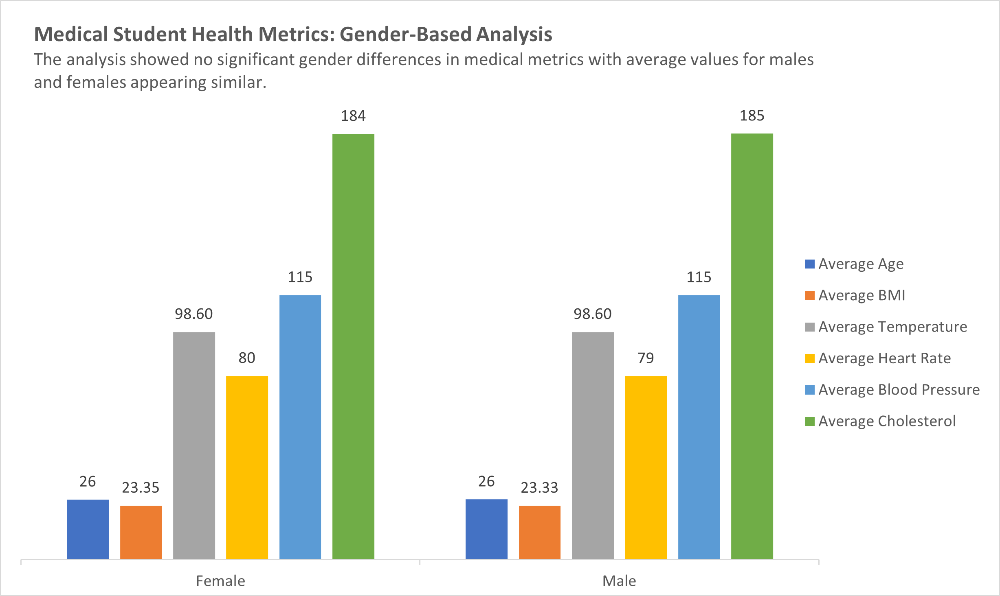
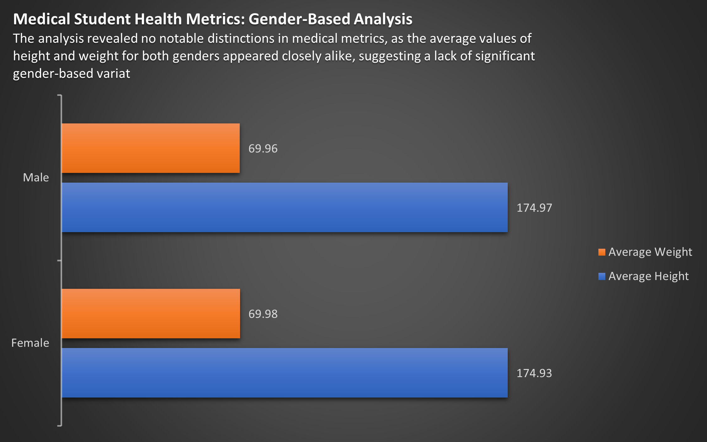
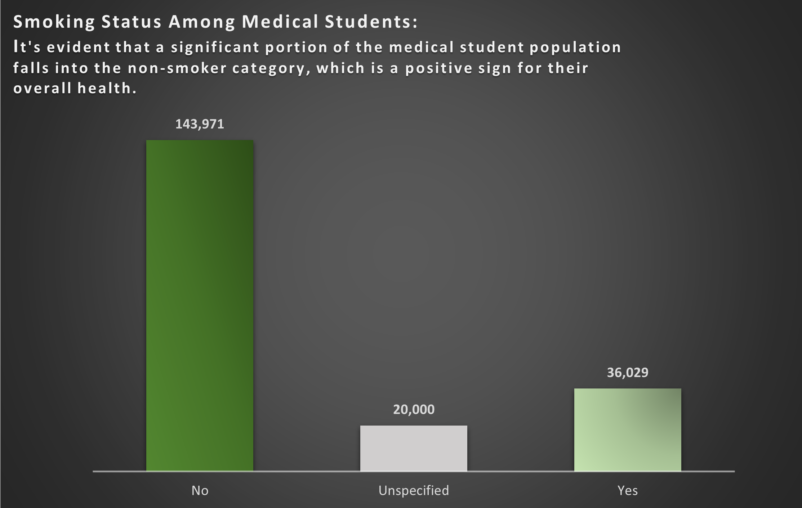
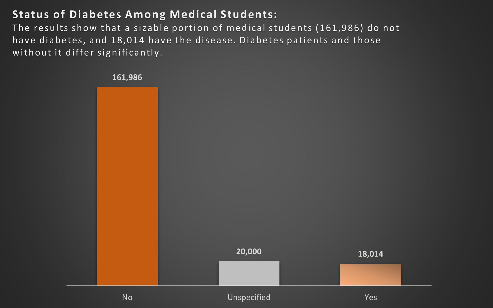
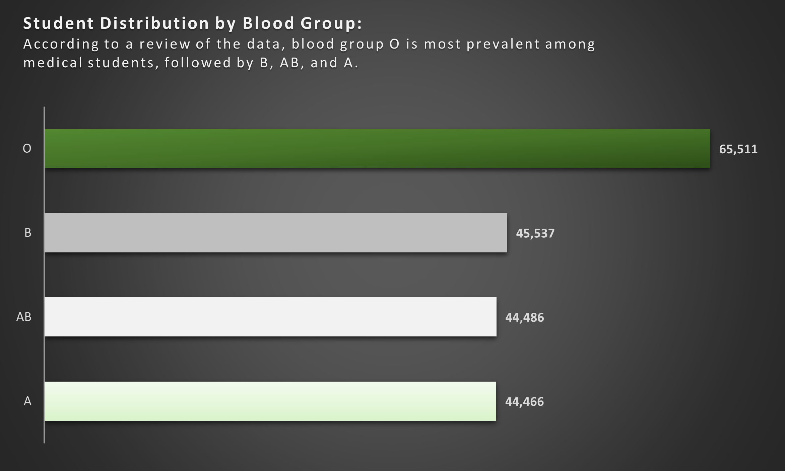

# Medical-Student
Analysis and Visualization of Health Data for Medical Students: A Comprehensive Report

## Introduction

In this in-depth examination of medical student data, I look into significant demographic and health aspects revealing important insights by building pivot tables, including average age, BMI, temperature, heart rate, blood pressure, and cholesterol for men and women, accurate height and weight statistics, a breakdown of blood groups, and a clear image of the smoking and diabetes status of pupils. 

Join me as I analyze these potential medical professionals' health profiles...🙂😉

_**Disclaimer**_ ⚠️- _All data used for this analysis are hypothetical data generated and do not represent any company's data or an attempt to endanger their performance._

## Medical-Students of "ADX TEACHING HOSPITAL"
The task is to create Pivot Tables displaying the following:
1. Average values for the following for Male and Females (Age, BMI, Temperature, Heart Rate, Blood Pressure, and Cholesterol)
2. Average Height and Weight for both Genders (in 2 decimal places)
3. Number of students across the different Blood Groups
4. Number of Students who smoke and those who don't
5. Number of Students who have diabetes and those who don't.
6. Visualize the insights gotten from the Pivot Table

## Problem Statement:

The primary goal of the analysis is to examine and draw important conclusions from a dataset of medical students' demographic data, health metrics, and lifestyle choices. Understanding the variations between the male and female students, blood types, smoking patterns, and diabetes status.

## Skill and Concept Demonstrated:

The analysis had demonstrated a range of essential data analysis skills, such as:
- Data extraction
- Data Cleaning and Transformation
- Statistical measures and conditional logic to make data-driven decisions.
- Excel functions (e.g., AVERAGEIF)
- Pivot Table Creation and Analysis
- Data Visualization

## Data Sourcing:

The medical student data was provided by the instructor in CSV format. The dataset contained information about medical students, including age, gender, BMI, temperature, heart rate, blood pressure, cholesterol, height, weight, blood group, smoking status, and diabetes status.

## Data Transformation:

After importing the CSV data into Microsoft Excel, the dataset was cleaned to resolve missing values, removing more than 40,000 blanks. To ensure data accuracy, data validation and verification were done after that.:muscle:

## Pivot Table Representation:

#### Image 1: *Average value for the gender (Age, BMI, Temperature, Heart Rate, Blood Pressure, and Cholesterol)*

### Image 2: *Average Height and Weight for both Genders (in 2 decimal places)*

*Student count across Blood Groups*             |   *Smoking Status*               |   *Diabetes Status*
:----------------------------------------------:|:--------------------------------:|:---------------:
                             |                  |  

## Visualization and Analysis

From the pivot table, the following insight were achieved:

----

----

----

----

----

## Conclusions and Recommendations

Based on the analysis:

- I discovered a need to Clarify the "Unspecified" Category in the dataset; It's essential to investigate and categorize the 20,000 unspecified cases. Without knowing their smoking status, it's challenging to make informed decisions or provide targeted support or interventions.
- Implement a process to reach out to these students to determine their smoking status, whether they are smokers, non-smokers, or former smokers. This can be done through surveys, interviews, or self-reporting mechanisms.
- Promote Smoking Cessation Programs With 36,029 students identified as smokers, there is a significant opportunity to implement smoking cessation programs within the medical student community.
- Programs can include counseling, access to nicotine replacement therapy, educational materials, and support groups.Encourage and incentivize smokers to participate in these programs to help them quit smoking and improve their overall health.
- In regards to the diabetic students, provide diabetes-specific health education and monitoring programs for diabetic them, emphasizing self-care, regular glucose monitoring, and lifestyle management.
- Collaborate with campus cafeterias to offer healthier, diabetes-friendly meal choices and provide nutritional information, promoting better dietary options for students with diabetes.

Lastly, it would be beneficial to periodically update the data and conduct follow-up assessments to track changes in the smoking status and diabete status as well as the effectiveness intervention programs put in place.

## Acknowledgemnent 🙏 🙏

Online sources were used to obtain the first and last image in this documentation:
- https://pngtree.com
- https://www.freepik.com

